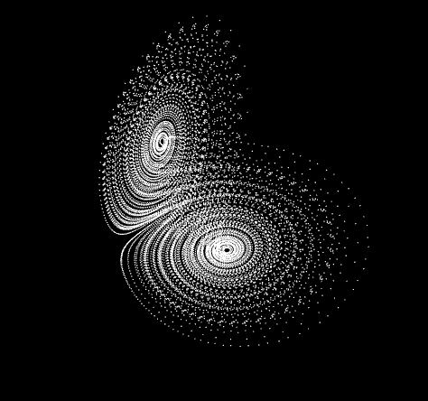
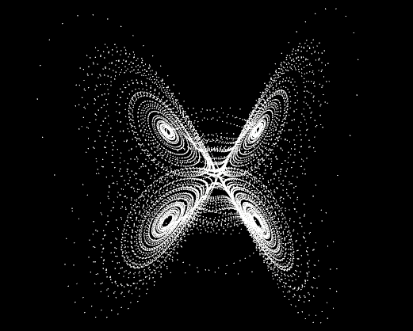

# 🌀 Visualização do Atrator de Lorenz

Este projeto apresenta uma visualização do **Atrator de Lorenz**, um dos exemplos mais clássicos de sistemas dinâmicos caóticos na matemática.

A simulação evidencia como pequenas variações nas condições iniciais podem resultar em comportamentos completamente distintos ao longo do tempo — fenômeno conhecido como **Efeito Borboleta**.

---

## 🧠 Sobre o Projeto

O sistema de Lorenz é descrito por um conjunto de equações diferenciais não lineares:

dx/dt = σ(y - x)
dy/dt = x(ρ - z) - y
dz/dt = xy - βz

A partir dessas equações, o projeto realiza uma simulação numérica em tempo real, gerando uma representação visual tridimensional do comportamento caótico do sistema.

---

## 🖼️ Visualização

<p align="center">
  
  
</p>

<p align="center">
  <em>A simulação funciona como uma animação contínua (quase um vídeo em tempo real), onde a trajetória do sistema é construída progressivamente.</em>
</p>

---

## ⚙️ Tecnologias Utilizadas

* JavaScript
* p5.js
* WEBGL (renderização 3D)

---

## 🚀 Como Executar

1. Clone o repositório:

```
git clone https://github.com/phsmontheiro-glitch/SEU-REPO-AQUI
```

2. Acesse a pasta do projeto:

```
cd SEU-REPO-AQUI
```

3. Abra o arquivo `index.html` no navegador
   (ou utilize a extensão Live Server no VS Code)

---

## 🚀 Funcionamento

* O sistema é inicializado com valores iniciais para as variáveis x, y e z
* A cada iteração, as equações são aplicadas para calcular a evolução do sistema
* Os pontos gerados são armazenados e renderizados no espaço tridimensional
* A visualização alterna entre linhas e pontos conforme a densidade da trajetória
* A navegação é interativa, permitindo rotação da cena com o mouse

---

## 🎯 Objetivos

* Aplicar conceitos de sistemas dinâmicos e caos
* Traduzir modelos matemáticos em visualizações computacionais
* Desenvolver raciocínio lógico e modelagem
* Produzir um projeto técnico relevante para portfólio

---

## ⭐ Observação

Este projeto integra estudos em programação e matemática aplicada, com foco na exploração de sistemas complexos por meio de visualização computacional.
